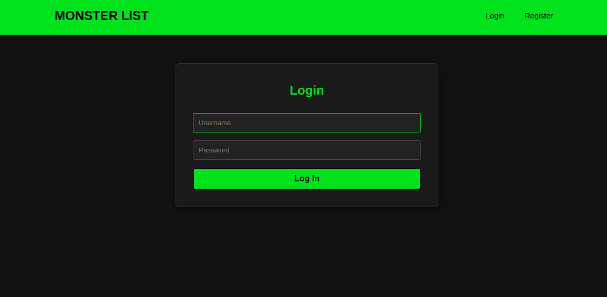
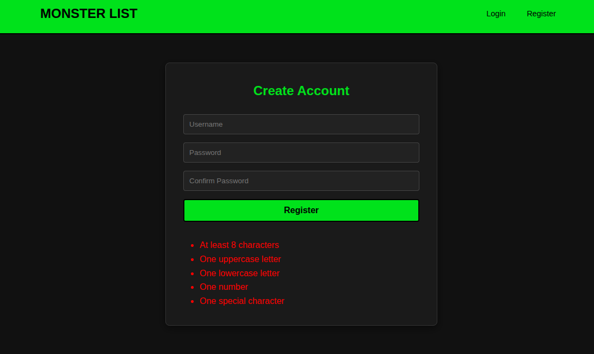
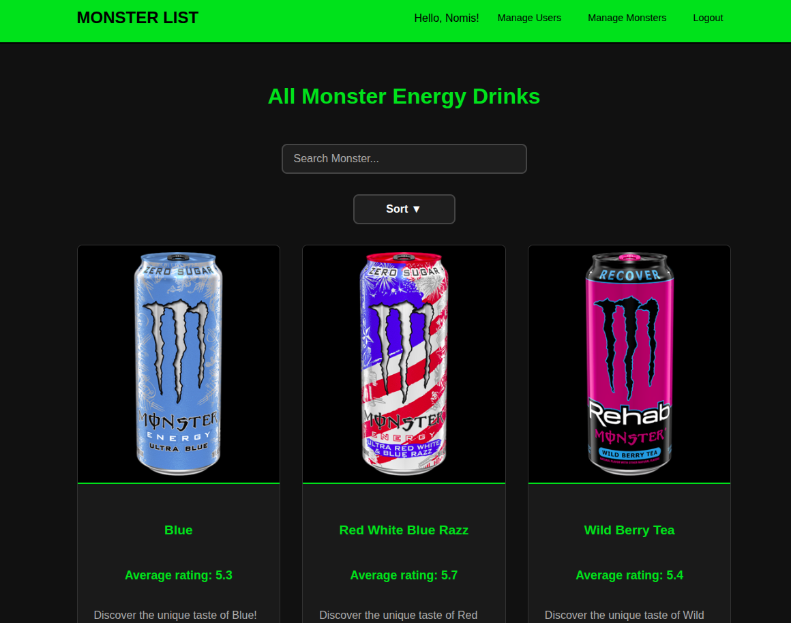
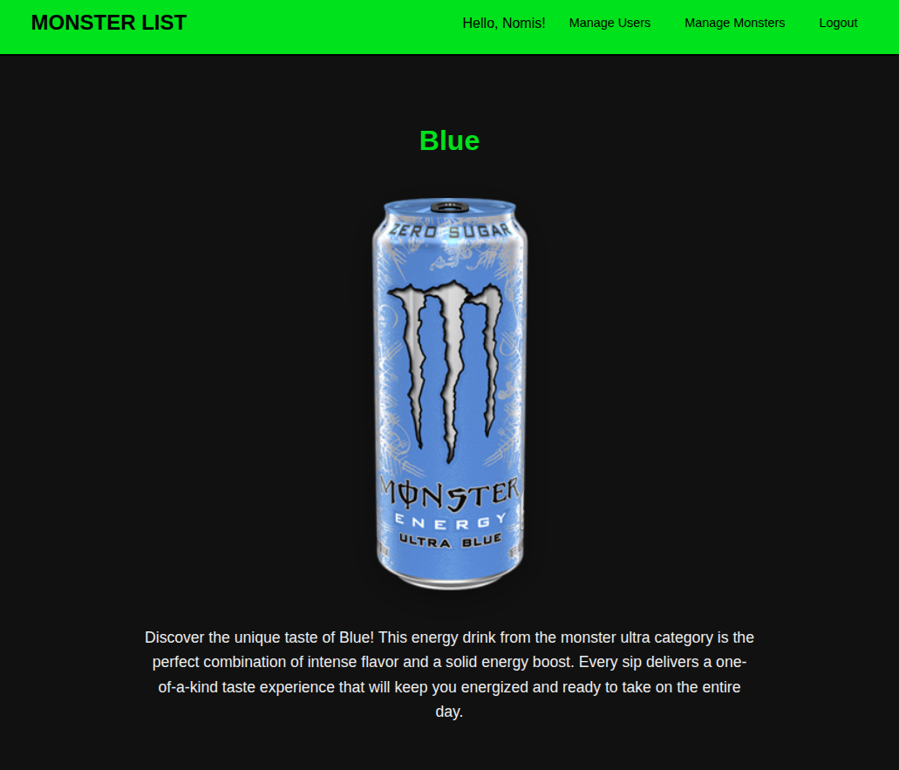
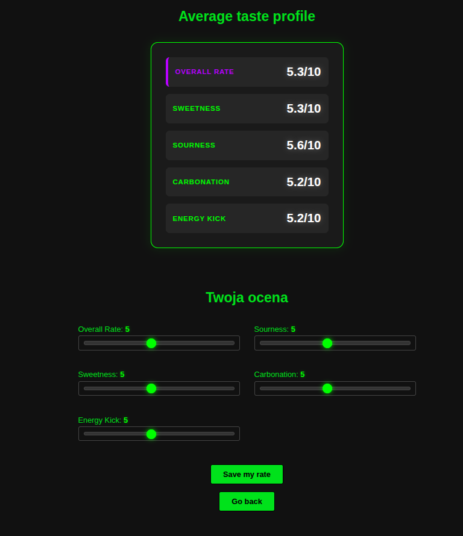
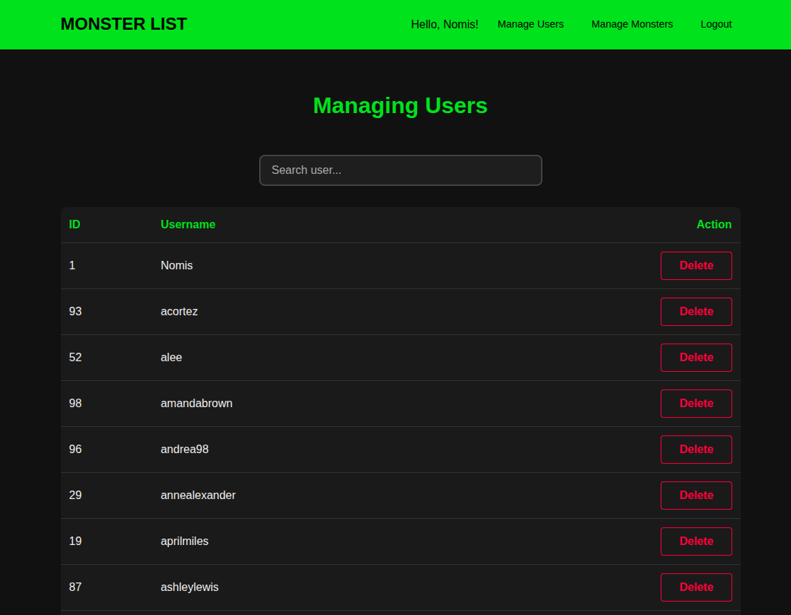
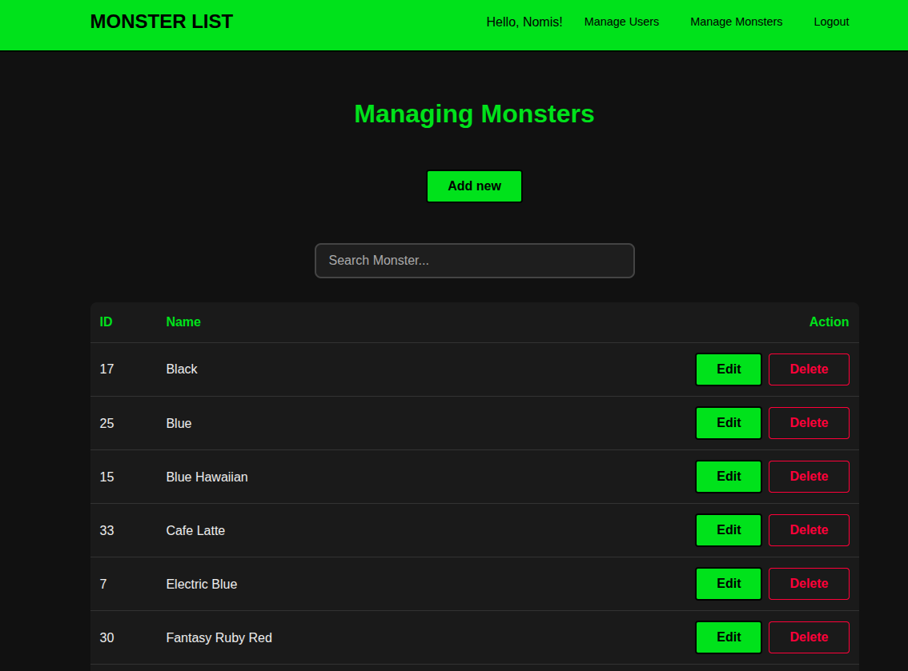
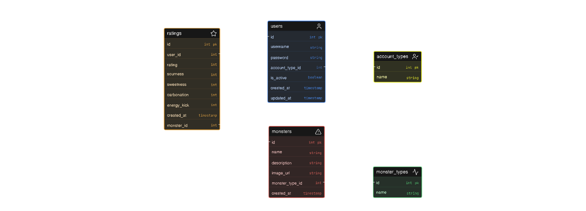

# RateDaMonster

RateDaMonster is a PHP web application that allows users to browse, rate, and review Monster Energy drinks. Users can create accounts, submit ratings for different Monster flavors, and view ratings from other users. Administrators can manage both users and Monster entries through a dedicated admin panel.

---

## Features

### User Features

* User registration and login
* Secure password hashing with bcrypt
* Password strength validation
* Session-based authentication
* Browse Monster Energy drinks
* View detailed information about each Monster flavor
* Submit ratings based on:
  * Overall rating
  * Sourness
  * Sweetness
  * Carbonation
  * Energy kick
* View ratings submitted by other users

### Admin Features

* User management dashboard
* User list
* Delete users
* Monster management dashboard
* Add new Monster drinks
* Edit existing Monster drinks
* Delete Monster drinks

---

# Screenshots

## Authentication Pages
**Login Page**    


**Register Page**   


---

## User Pages
**Monsters List Page**  


**Monster Details Page**  


**Monster Details Page**  


---

## Admin Panel

**Admin Users Page**    


**Admin Monsters Page**


---

## Database Diagram

### ERD (Entity Relationship Diagram)


---

## Technology Stack

### Backend

* PHP 8+
* PostgreSQL
* PDO

### Frontend

* HTML5
* CSS3
* Vanilla JavaScript

### Infrastructure

* Docker
* Nginx
* PostgreSQL

---

## Project Structure

```text
RateDaMonster/
|
├── certs/
|
├── docker/
│   ├── db/
│   ├── nginx/
│   └── php/
|
├── public/
│   ├── views/
│   ├── scripts/
│   ├── styles/
│   └── img/
│
├── src/
│   ├── controllers/
│   └── repositories/
│
├── docker-compose.yaml
├── config.php
├── Database.php
├── Routing.php
└── index.php